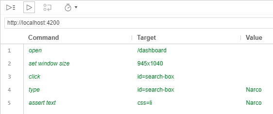

# UI Testing Travel Guide

_Note: do not write down project or customer names here as this file will be checked in to a public repostory_

## Introduction

### Topic
Before everything, let us give you a little bit of context. This session is about UI testing in general and how to introduce UI testing concept into the project. We called it metaphorically "UI testing travel guide" because you can make a parallel between this and traveling to a new country. We will advise which places are worth of visiting and how to avoid dark corners. In the end you will see how to adopt the best of this experience.

### Claim
Regarding our knowledge and our practical experience that we gained from other projects, we claim that you can implement a reliable UI test suite using a Selenium-based approach which will make your safety net stronger.

### About us

We met on some of the existing projects in the phase when UI testing had been introduced. 

So, I am ...
* Marija
* Milan
* Christian

During this slot we will share with you all the insights, tips and tricks that we gathered from other projects, but most valueable thing that we bring is from the current one where we had exclusive opportunity to see how UI testing is developed and introduced from scratch.

### Overview

Our presentation is structured in following five parts:

* How to develop
* What to test
* How to setup a stable environment
* How to implement maintainble tests 
* How to implement reliable tests

## How to develop

### Consider Alternatives

First of all, you have to decide whether or not to use Selenium at all. You can model persona for your team and according to its prefrences, strengths and what you actually want to detect and make with the test you can choose the tool. So what are the alternatives?

* Cypress - Open source, tests are written using Mocha and Chai, tests are running in real time in  browser. Extremely popular, for pro js developers, no paralellization od the tests and it is restricted to Chrome.
* Cucumber - BDD approach, Gherkin syntax. It is the simple, lightweight and structured language that used to describe features, requirements, and scenarios.
* TestCafe - restricted to js. Hard to run on multiple browsers, faster and easier installation. Better support for debugging. New tool - small community.
* Katalon Studio - Record/playback with page object models support. Software tool, has been built with readily usable features. You just need to configure the software and use it for automation. Programming knowledge not required.

Now when you know where is your team strong at and what you want to achieve with the UI tests, you have to request some features that your tool should have if you want to have this journey successful in long-term way.

#### Features that every UI testing tool has to consider
* Minimal installation and setup pain - if it takes the days and if you need dedicated proffesional for this, skip it. UI testing is anyway slow process, who needs more days for installation only?
* Speed - More and more features are comming, more and more features need to be tested. If you need more than 30 minutes for test suite, you should probably find another tool
* Test case recording
* Support for debugging - anything smarter than step by step debugging and logging would be a plus.
* Test/Test steps reuse - you will for sure  have a need to repeat test  steps among the tests. Better to have a way to reuse this.
* Beginner-friendliness and short learning curve - UI testing falls on the shoulders of manual QAs or even non-QA staff. So wouldn’t it be great to have a tool that’s simple?
* Smart handling of timeouts - No matter how great you are at coding your tests, no person can possibly like to hand-code workarounds for test timeouts
* CI support - Must have

#### Commercial Products

There are commercial products like "Ranorex" or "Tosca". The come with a price tag and a lot of features you probably do not need like:

* test case management
* testing non-web UIs 
* test data generation
* test case recording
* test-data setup

### How does Selenium work

* Selenium server (either standalone as jar on your local machine or remotely via service)
* The Selenium Server takes care of interpreting commands from the test and forwarding them to one or more browsers. Communication between the server and the browser uses the WebDriver Wire Protocol, a JSON protocol. The command is interpreted by the Browser Driver.
* The implemenation depends on drivers. For Chrome it is a Chrome driver, for Firefox it is an extension.

### How to control,TypeScript vs. C# or Java

Now the question is, how to control the Selenium server. There are libraries in JavaScript, C#, Java, Ruby and Phyton to control the API exposed by the Selenium server.

#### Demo: Basic test case in TypeScript

Selenium also offers a tool to record. This is called *Selenium IDE*. It lets you quickly record a test case.

#### Pattern: Test case recording

*Problem*: Test case implementation is costly. It takes quite some time to implement a UI test. Non-functional requirements of a UI test include:

* Reliability: a UI test suceeding once should succeed always when nothing in the application or test code as changed
* Maintainability: a change in the UI structure should have as little impact to the test implementation as possible

*Solution*: Test cases can be recorded by a tool. The tool automatically detects a matching and stable selector.

*Advantages*:

* fast implementation
* lower learning curve

*Drawbacks*: 

* maintenance will grow as selectors are repeated over and over again 
* selectors might not be detected as you wish

*Related Pattern*: The alternative is to implement test yourself. 

#### Demo: Test case recoding with Selenium

## What to test?

top of the test pyramid

UI tests are slow and costly

### Granularity

*Problem*: UI tests are costly to implement and slow to execute. 

Non-functional requirements of a UI test include:

* Reliability: a UI test suceeding once should succeed always when nothing in the application or test code as changed
* Maintainability: a change in the UI structure should have as little impact to the test implementation as possible
* Fast feedback: as every other test a UI test should provide fast feedback
* Documentation: a UI test acts as a documentation on how a system is supposed to work

#### Pattern: Avoid UI tests

*Solution*: Avoid implementing UI tests at all. Implement tests as contract tests, integration tests or unit tests (in both the UI and the backend).

*Advantages*:

* no need to pay for implementation, build setup, test data setup, external system simulators, maintenance, ...

*Drawbacks*: 

* You deliberately take a higher risk
* Many of the steps required for automated UI tests like test data or external system simulators are also useful for development

*Related Pattern*: see other patterns in this chapter "Granularity"

#### Pattern: Very few (< 10) UI tests

*Solution*: Design the tests so that they cover all possible connections between the components. Example: You have an we wich hosts the UI, an applicaiton server for the business logic (420 use cases), a job server for report creation (there are 500 different reports) and an distribution system for sending emails (42 different templates in 8 different languages). For that scenario there might be two test cases: one case creating a single report and another one calling the distribution service. 

*Advantages*:

* lower costs
* little need to go with a full blown, highly maintainable UI testing codebase
* fast execution, fast feedback (given that your deployment and test data setup is also fast)

*Drawbacks*: 

* there might be still a gap between what you can cover in lower stage tests and what you cover with UI tests
* documentation

*Related Pattern*: see other patterns in this chapter "Granularity"

#### Pattern: Few (< 100) UI tests

*Solution*: Design the tests so that they cover the happy-cases of the main features of the application. Like the main scenario. Prefer few but comprehensive tests over small but many tests. 

*Advantages*:

* reasonable feature coverage
* good documentation

*Drawbacks*: 

* reaching a good level reliability and maintainability is expensive
* execution time will suffer
* failure analysis: a comprehensive test which is failing does not directly point to the area in the application where something is wrong, it needs manual analysis

*Related Pattern*: see other patterns in this chapter "Granularity"

#### Pattern: Many (> 100) small UI tests

*Solution*: Test cases are split into small parts. These parts test a dedicated functionality. Test depend on each other. Example: there is a test A which tests the login functionality. And then there are two other tests B and C depending on the fact, that login is working. Even though they probably log in as well, they will not be executed when the test A fails.

*Advantages*:

* failure analysis: faster because test tests only 1 (or at least few) functionalities
* execution time is optimized, failing fast
* reasonable up to perfect feature coverage

*Drawbacks*: 

* getting a documentation out of the tests is more difficult
* an infrastructure when it is very easy to just add a new UI test might lead to having too many UI tests

*Related Pattern*: see other patterns in this chapter "Granularity"

### What browser to target?

Chrome only or do you need to support IE, Edge and Firefox as well? And, well, there are mobile devices as well.

Discussion "Focusing on Chrome only"

Pro:
* the tooling for Chrome is the most advanced
  * stable Chromedriver
  * Docker images easily available
* the UI test cases do not test for cross-browser issues

Cons:
* 80% of the users are not using Chrome but ...
* Chrome is not be on the list of the browsers which have to be supported

## How to setup a stable environment

### Deploy & Build System

### Versions

With so many libraries and applications (Browser, Selenium Server, Selenium library, Protractor library) it happens that tests run on one environment and fail in another due to different versions. 

In order to have stable environment for running UI tests, locally but on the build server also, we need to fix versions of Selenium Server, Chrome driver version, as well as NPM package version which is used to install Selenium standalone. They need to be the same on the build server as it is locally, so that we can have reliable tests.

Locally, we can use scripts such as PowerShell cmldets or batch scripts to install and run correct versions of those components (npm package, etc.). On the (build/test) server similar can be achieved by using preinstalled environments, such as environment in a Docker image.

### External Systems

*Problem*: Systems outside of your application are not under your control. They might be running or might be down. They might return what is specified in the interface agreement or the might return something else. When you are testing end-to-end, you have to specify where the end is. One definition could be from one external system, through your application to another external system. In order to have a stable environment where you can run automated tests reliably, you have to bring these external systems under control.

#### Pattern: Mock external systems in the application

*Solution*: Using dependency injection, mock services are injected for external sytems directly in the system under test. Instead of connecting to an external system they use the mocks service in-process.

*Advantages*:

* faster execution
* lower cost for implementation

*Drawbacks*: 

* the communication from your application to the external system is not tested
* having no test code in your productive codebase is a challenge
* could be potentialy misaligned with the real system if not mocked correctly or in proper level of detail.

*Related Pattern*: see other patterns in this chapter "External Systems"

#### Pattern: Mock external systems outside the application

*Solution*: The application connects to a system whith the same interface agreement as the real external system but which is developed and deployed by you.

*Advantages*:

* the communication from your application to the external system is tested
* no test code in your productive codebase
* allows to simulate network failures

*Drawbacks*: 

* more expensive

*Related Pattern*: see other patterns in this chapter "External Systems"

### Test Data

*Problem*: Tests build on a certain state.

*Requirements": 
* test data setup and management is as close a possible to the test code
* test do not depend on each other, so their test data is separated / do not depend on shared test data (except reference data)

#### Pattern: DB Dump

*Solution*: Using a (pre)created DB dump, which is restored before Test Suite start running.

*Advantages*:

* restoring a DB snapshot/backup allows to start testing very fast.

*Drawbacks*: 

* test data management is far away from the test implementation
* using DB modification scripts to setup the test data is cumbersome 

*Related Pattern*: see other patterns in this chapter "Test Data"

#### Pattern: Test Data Generator

*Solution*: Use a Test Data Generator (app), before running test to setup test data.

*Advantages*:

* improved test data management / overview
* re-use of builders from integrationtests possible
* can also feed your external system simulators

*Drawbacks*: 

* test data management is far away from the test implementation
* executing the generator might setup the data required for all test leading to slow execution during development
* implementing a test data reset/update mechanism (once the test changed the data) is hard
* going back to a DB snapshot and re-running the generator is time consuming
* expensive to implement

*Related Pattern*: see other patterns in this chapter "Test Data"

#### Pattern: Test setups Test Data directly in DB

*Solution*: Test data is setup directly in DB from the test.

*Advantages*:

* re-use of builder from integrationtests 
* faster test setup 
* only setting up the data required data (for a single test during development)

*Drawbacks*: 

* reusing builders from integration test is hard to implement when tests are implemented (i.e. TypeScript) in another language than in the backend (i.e. C#), calling .NET code from TypeScript is theoretically possible using Edge.js but such an attempt failed in one project because it requires node to be installed which was not possible then
* when using different languages in test and backend and connecting to DB directly from the test

*Related Pattern*: see other patterns in this chapter "Test Data"

#### Pattern: Test setups Test Data using Web API

*Solution*: Test setup data by using Web API in the backend to perform parts of a test setup

*Advantages*:

* tests that are faster, more focused, and more reliable.
* almost every modern programming language has libraries that can be used to make REST API calls.

*Drawbacks*: 

* either exposing test-only endpoints in productive code
* when using different languages in test and backend: leads to kind of a duplication of the builder infrastructure in the two languages

*Related Pattern*: see other patterns in this chapter "Test Data"

#### Pattern: Test setups Test Data while testing

*Solution*: Test data is setup in each test, by reading it from some file, such as .json. 

*Advantages*:

* no infrastructure required

*Drawbacks*: 

* works only in limited cases
* tests are force not to test "a single thing"
* slower test execution

*Related Pattern*: see other patterns in this chapter "Test Data"

## How to implement maintainble tests

### Pattern: Page Object

*Problem*: Instead of ad-hoc interactions with a page, a test controls the page using an instance that represents the page user interface.

*Solution*: Page Objects are used to make end-to-end tests readable and easy to maintain  =by encapsulating information about the elements on application page.

Page Objects include different kinds of constructs, such as basic elements, nested selectors, etc.

* Basic Elements rovide classes for basic html Elements, like for example a button, a button then has the method click() whereas a representation of the basic html element textarea does not have click() but something like setText().

* Nested selectors: a page object is responsible for a certain area of the complete screen, localized by a selector (i.e. main-content). A specific element (like a button) exposed by this page object is (almost) always contained in the surrounding area. That means, the selector can be combined/nested. In this case as css selector: .main-content > button.

*Advantages*:

* They keep all page element selectors in one place (no duplication).
* They standardize how tests interact with the page.
* They decouple testing code from the application.

*Drawbacks*: 

* Hard to maintain and take away time from actual application development. I have never seen PageObjects documented well enough to actually help one write tests.
* Introduce additional state into the tests, which is separate from the application’s internal state. This makes understanding the tests and failures harder.
* Try to fit multiple cases into a uniform interface, falling back to conditional logic - a huge anti-pattern in our opinion.
* Make tests slow because they force the tests to always go through the application user interface.

*Related Pattern*: "App Actions" (see https://www.cypress.io/blog/2019/01/03/stop-using-page-objects-and-start-using-app-actions/)

### Pattern: Selector with data-attribute

*Problem*: In order for Selenium to select an element on the page, a selector (aka. locator) has to be defined. CSS selectors can be used, as well as XPath queries or just the string of the element containing. With Protractor you can even use the ng-model name or a binding. As outlined in the page object pattern, selectors are best nested so that the area for Selenium where to search for an element is as small as possible. Nevertheless, it sometimes remains hard for a page object to specify the correct selector. 

*Solution*: Adding additional information to the DOM helps selecting elements in the DOM. One option is to add additional id attributes or additional classes. The problem with this approach is, that id are intended to be unique throughout the page and classes are supposed to be used for styling and not for testing. So the approach is to add a `data-testId` attribute. In order not to pollute the productive application with unused attributes, this data attributes are removed when building for production. Classes and regular IDs are no longer used for selectors.

*Advantages*:

* specific identifier for tests
* no HTML pollution in production

*Drawbacks*: 

* attribute has to be added, most probably during development of the test

*Related Pattern*: Self-Healing Automation

### Pattern: Self-Healing Automation

*Problem*: In order for an automated test to select an element on the page, a selector (aka. locator) has to be defined. These selectors might change while the application is developed without the test being updated.

*Solution*: Use a product with a "self-healing" functionality. They, sometimes supported by an AI, learn when a particular selector changed its selector and it adjusts the selector while the test is running.

*Advantages*:

* more reliable
* easier to maintain

*Drawbacks*: 

* changes to the test have to be accepted at some point

*Products*:

* recheck-web (Demo)
* Applitools
* mabl
* Perfecto

See also: https://www.yammer.com/zuehlke.com/threads/303810815508480

*Related Pattern*: Selector with data-attribute

*Demo*: Recheck / Java

## How to implement reliable tests

*Problem*: Even tough you have setup a stable environment and your tests suceeded multiple time, tests still fail randomly with `NoSuchElementException`, `ElementNotVisibleException` or a similar exception. This is primarly due to timing issues. The element might not be in the DOM because there is still an XHR request going on. Or it is not clickable because there is an animation running which takes its time. Or the UI framework just did not yet finish rendering. 

### Pattern: Implicit wait

*Solution*: Selenium has the possiblity to switch implicit wait on. An implicit wait is to tell WebDriver to poll the DOM for a certain amount of time when trying to find an element or elements if they are not immediately available. The default setting is 0 which means implicit wait is disabled. 

*Advantages*:

* promise to just work

*Drawbacks*: 

* there are more wait conditions checked than nescessary which results in slower execution time

*Related Pattern*: see in this chapter

### Pattern: Explicit wait (where needed)

*Solution*: An explicit wait is code you define to wait for a certain condition to occur before proceeding further in the code. The worst case of this is `Thread.sleep()`, which sets the condition to an exact time period to wait. There are convenience methods available to help you write code that will only wait as long as required. The Seleniums API `ExpectedCondition` is one way to do this, another way is to implement your own retry mechanism for example with the Polly library in .NET. Wait conditions are only added where needed (i.e. after triggering a page action which requires a backend call).

*Advantages*:

* only waiting for what needs to waited for
* failing fast and not unnesscesary waiting

*Drawbacks*: 

* its sometimes hard to figure out where to add the wait condition
* From documentation: Do not mix implicit and explicit waits! Doing so can cause unpredictable wait times. 

*Related Pattern*: see in this chapter

### Pattern: Explicit wait (generic)

*Solution*: Given you have a mean to determine when the page is expected to be ready, you can implement your own waiting strategy. For example if you can determine when the frontend is waiting for a backend call to respond, you can wait for that to happen and do not have to wait for a message to appear on the screen. 

*Advantages*:

* only waiting for what needs to waited for
* no unnesscesary waiting results in faster execution time
* failing fast because the test knows when to wait
* waiting solved in a 'one beats all' manner

*Drawbacks*: 

* requires means to inspect application and determine its internal state

*Related Pattern*: see in this chapter

### Pattern: Use Protractor 

*Solution*: If you happen to use Angular you can use the Selenium wrapper "Protractor". Protractor basically does an explicit wait in a generic fashion: "Protractor can automatically execute the next step in your test the moment the webpage finishes pending tasks, so you don’t have to worry about waiting for your test and webpage to sync."

*Advantages*:

* waiting solved in a 'one beats all' manner

*Drawbacks*: 

* unfortunately, what Protractor waits for is not enough
* special effort is required when your test leaves the Angular application

*Related Pattern*: see in this chapter

### Pattern: Wrap all calls to Selenium and

*Solution*: All calls to Selenium are passed through a wrapper. In this wrapper, every time an element is accessed, there is an explicit wait condition for the element to be visible, clickable or whatever is best suited. 

*Advantages*:

* it works

*Drawbacks*: 

* there are more wait conditions checked than nescessary which results in slower execution time
* special effort is required when your test leaves the Angular application
* does not fail fast because it first waits

*Related Pattern*: see in this chapter

### Sidenote: Cypress

*Solution*: The solution of Cypress to the timing is that they implement an explicit wait on every element interaction (see: https://docs.cypress.io/guides/core-concepts/interacting-with-elements.html#Actionability)

*Advantages*:

* 

*Drawbacks*: 

* 

*Related Pattern*: see in this chapter

## Conclusion
